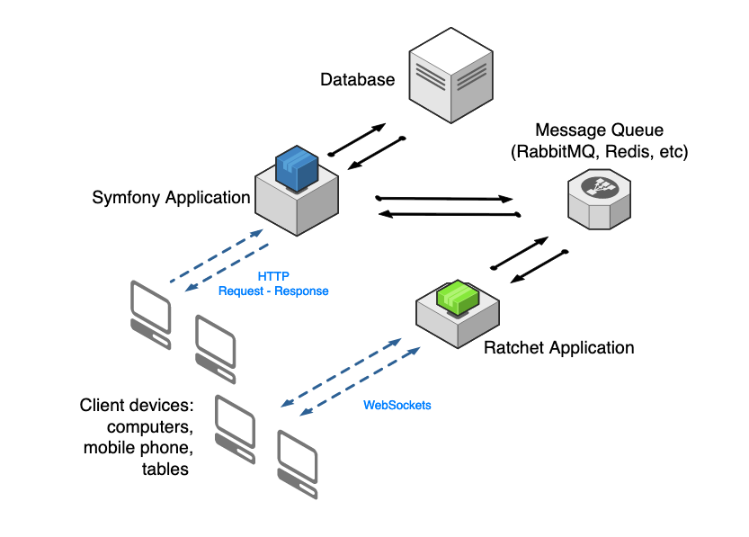

class: center, middle

# Real-time data in<br> PHP applications

## Talks #112

???

Real-time data in PHP applications

---
class: center, middle

# Mihai Nica

## CTO @ Wise Systems

Making and breaking stuff web related stuff since 2005.

???

- Lucrez in bransa din 2005
- Inceput cu PHP
- Alternat backend (PHP, NodeJS) cu frontend (Angular, Vue)
- DevOps

---
class: middle

# What we'll talk about

1. Need for real-time data
1. How to do it
    1. Short/long pooling (the legacy way).
    1. WebSockets
    1. Server Sent Events (SSE)
1. Conclusions

???

Audienta?

Agenda

- Utilizatorii asteaptea interactiuni in timp real
- Metode de obtiune asta
- Concluzii

---
class: middle

# Real-time data

## Users expect real-time data

1. Notification
1. Activity streams
1. Data visualization (dashboards 📊 )
1. Chat
1. Multi-user collaboration

???

- Notificari
- Fluxuri de activitate
- Vizualizare de date si dashboard-uri
- Chat
- Editare colaborativa (ex. Google Docs)

---
class: middle

# How to do it

1. Short/long pooling (the legacy way).
1. WebSockets
1. Server Sent Events (SSE)

???

Cum facem chestia asta.

- Long pooling - majoritatea au incercat asta
- WebSockets - cea mai populara / cunoscuta optiune
- Server Sent Events - fratele mai mic si mai prost al WebSockets

---
class: middle

# Pooling

```javascript
function doPoll(){
    $.post('ajax/test.html', function(data) {
        updatePage(data);
        setTimeout(doPoll,5000);
    });
}
```

???

Pooling - jQuery

---
class: middle



???

Websocket diagram

---
class: middle

# WebSockets

## Client

```javascript
var exampleSocket = new WebSocket("wss://example.com/sock", ["x-chat"]);

// react to services
exampleSocket.onmessage = event => console.log(event.data);

// send
exampleSocket.send("Here's some text that the server is urgently awaiting!");
```

???

Websocket client

---
class: middle

# WebSockets

## Server

```php
// Run the server application through the WebSocket protocol on port 8080
$app = new Ratchet\App('localhost', 8080);
$app->route('/chat', new MyChat, array('*'));
$app->route('/echo', new Ratchet\Server\EchoServer, array('*'));
$app->run();
```

???

Websocket server

- Ratchet bazat pe ReactPHP (non-blocking IO).
- Va fi o aplicatie separata, nu poate folosi Apache + mod_php / PHP-FPM

---
class: middle


???

Mercure diagram

- o noua modalitate pentru a trimite data de pe server in timp real 
- server: protocol + libraie client + server / dispatcher
- client: server sent events merge pe toate browserele noi, indiferent de dispozitiv

---

class: middle

# Server Sent Events

## Client

```javascript
// The subscriber subscribes to updates for the https://example.com/users/dunglas topic
// and to any topic matching https://example.com/books/{id}
const url = new URL('https://example.com/hub');
url.searchParams.append('topic', 'https://example.com/books/{id}');
url.searchParams.append('topic', 'https://example.com/users/dunglas');

const eventSource = new EventSource(url);

// The callback will be called every time an update is published
eventSource.onmessage = event => console.log(event); // do something with the payload

```

???

WSS Client

---
class: middle

# Server Sent Events

## Server

```php
// change these values accordingly to your hub installation
define('HUB_URL', 'https://demo.mercure.rocks/hub');
define('JWT', 'XJlIjp7InN1YnNjcmliZSI6WyJmb28iLCJiYX...');

use Symfony\Component\Mercure\Publisher;
use Symfony\Component\Mercure\Update;
use Symfony\Component\Mercure\Jwt\StaticJwtProvide;

$publisher = new Publisher(HUB_URL, new StaticJwtProvide(JWT));
// Serialize the update, and dispatch it to the hub, that will broadcast it to the clients
$id = $publisher(new Update('https://example.com/books/1.jsonld', 'Hi from Symfony!', ['target1']));
```

???

WSS Server

- Mercure - integrarea din aplicatia PHP
- Data e trimisa prin HTTP la Hub care va face push

---
class: middle

# Thank you

## @redecs

???

Q&A

---
class: middle

# Reference

- https://developer.mozilla.org/en-US/docs/Web/API/WebSockets_API
- https://github.com/ratchetphp/Ratchet
- https://developer.mozilla.org/en-US/docs/Web/API/Server-sent_events
- https://mercure.rocks
- https://symfony.com/doc/current/mercure.html
